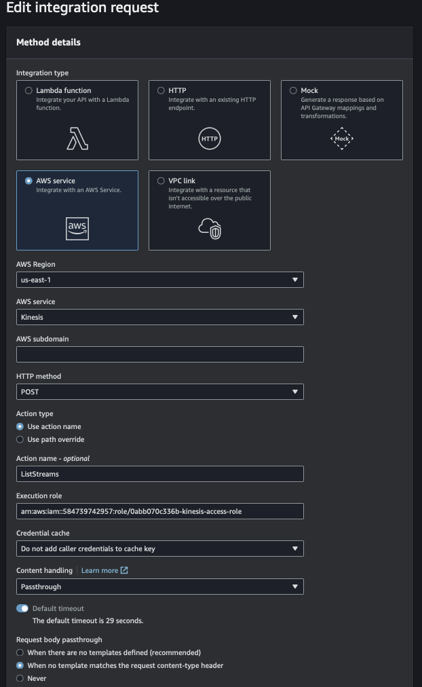

# Pintrest Data Pipeline

## Table of Contents
- [Description](#description)
- [Project Dependencies](#project-dependencies)
- [The dataset](#the-dataset)
- [Utilized Tools](#utilized-tools)
  - [Apache Kafka](#apache-kafka)
  - [AWS MSK (Amazon Managed Streaming for Apache Kafka)](#aws-msk-amazon-managed-streaming-for-apache-kafka)
  - [AWS MSK Connect](#aws-msk-connect)
  - [Kafka REST Proxy](#kafka-rest-proxy)
  - [AWS API Gateway](#aws-api-gateway)
  - [Apache Spark](#apache-spark)
  - [PySpark](#pyspark)
  - [Databricks](#databricks)
- [Set-up](#set-up)
  - [Setting up the EC2 instance & Apache Kafka](#setting-up-the-ec2-instance--apache-kafka)
  - [Connecting MSK Cluster to an S3 Bucket](#connecting-msk-cluster-to-an-s3-bucket)
  - [Configuring API in AWS API Gateway](#configuring-api-in-aws-api-gateway)
  - [Setting up Kafka REST Proxy on the EC2 Client](#setting-up-kafka-rest-proxy-on-the-ec2-client)
- [Batch processing](#batch-processing)
  - [Data Cleaning](#data-cleaning)
  - [Data Analysis](#data-analysis)
- [Stream Processing](#stream-processing)
  - [Creating data streams with Kinesis](#creating-data-streams-with-kinesis)
  - [Configure an API with Kinesis proxy integration](#configure-an-api-with-kinesis-proxy-integration)
  - [Create user_posting_emulation_stream.py](#create-user_posting_emulation_streampy)
  - [Read data from Kinesis streams in Databricks](#read-data-from-kinesis-streams-in-databricks)
  - [Data Cleaning](#data-cleaning-1)
  - [Write the data to Delta Tables](#write-the-data-to-delta-tables)
- [File Structure](#file-structure)
- [License](#license)

## Description

Pinterest crunches billions of data points every day to decide how to provide more value to their users. In this project, I created a similar system using the AWS Cloud.

The project was planned for a month. It consisted of multiple steps, which I tried to briefly list below to paint the overview of the steps that were required to build a working data pipeline.

The whole process I have split into three parts:
- set-up,
- batch processing,
- streaming processing.

During this process, I gained proficiency in:

- Apache Kafka: An event streaming platform.
- AWS MSK (Amazon Managed Streaming for Apache Kafka): Fully managed service for Apache Kafka.
- AWS MSK Connect: Simplifies streaming data to/from Apache Kafka clusters.
- Kafka REST Proxy: Provides a RESTful interface to Kafka clusters.
- AWS API Gateway: Manages, monitors, and secures APIs.
- Apache Spark and PySpark: Multi-language engine for data engineering and machine learning.
- Databricks: Platform for Spark processing of batch and streaming data. 

##  Project Dependencies

To execute this project, you must have the following modules installed:

- python-dotenv
- sqlalchemy
- requests

##  The dataset

To replicate the type of data commonly handled by Pinterest's engineers, this project includes a script, user_posting_emulation.py, which, when executed from the terminal, simulates a flow of random data points resembling those received by the Pinterest API during user data upload POST requests.

The script initializes a database connector class that establishes an AWS RDS database connection. The database comprises three tables:

- pinterest_data: Contains information about posts being uploaded to Pinterest.
- geolocation_data: Holds data about the geolocation of each Pinterest post found in pinterest_data.
- user_data: Stores information about the user who uploaded each post present in pinterest_data.
The run_infinite_post_data_loop() method continuously cycles between 0 and 2 seconds at random intervals. During each iteration, it selects all columns of a random row from each table and compiles the data into dictionaries. These dictionaries are then printed to the console.

##  Utilized Tools

### Apache Kafka
Apache Kafka is an event streaming platform. 

### AWS MSK (Amazon Managed Streaming for Apache Kafka)
Amazon MSK is a fully managed service enabling the building and running of applications that use Apache Kafka to process streaming data. 

### AWS MSK Connect
MSK Connect is a feature of Amazon MSK that simplifies streaming data to and from Apache Kafka clusters. 

### Kafka REST Proxy
The Confluent REST Proxy provides a RESTful interface to an Apache Kafka® cluster, making it easy to produce and consume messages, view the state of the cluster, and perform administrative actions without using the native Kafka protocol or clients.

### AWS API Gateway
Amazon API Gateway is a fully managed service facilitating the creation, publication, maintenance, monitoring, and securing of APIs at any scale. APIs are the "front door" for applications to access data, business logic, or functionality from your backend services.

### Apache Spark
Apache Spark™ is a multi-language engine executing data engineering, data science, and machine learning on single-node machines or clusters. 

### PySpark
PySpark is the Python API for Apache Spark. It enables real-time, large-scale data processing in a distributed environment using Python. 

### Databricks
This project uses the Databricks platform to perform Spark processing of batch and streaming data. 

## Set-up

### Setting up the EC2 instance & Apache Kafka

EC2 instances serve as the foundational components of cloud computing. They are remote computers capable of executing code on a cluster or a single machine. Access to an EC2 instance can be obtained through a terminal.

### AWS EC2 Instance Setup Steps:
The detailed process is described in the corresponding prerequisite lessons. Here are the general steps:
1. **Key Pair File Creation:**
   - In the AWS console, create a key-pair file for authentication.

2. **Security Group Configuration:**
   - Create a security group with the following inbound rules:
     - `HTTP: Anywhere IPv4`
     - `HTTPS: Anywhere IPv4`
     - `SSH: My IP`

3. **EC2 Instance Creation:**
   - Create an EC2 instance by selecting the Amazon Linux 2 AMI.
4. **Installation of Kafka and IAM MSK Authentication Package:**
   - After launching and connecting to the EC2 instance, install Kafka and the IAM MSK authentication package on the client EC2 machine.

5. **Configuration of Kafka Client Properties for AWS IAM Authentication:**
   - Configure the Kafka client properties to enable AWS IAM authentication.

6. **Creation of Amazon MSK Clusters:**
   - Create Amazon MSK clusters to facilitate Kafka messaging.

7. **Creation of Kafka Topics:**
   - Create three Kafka topics on the Kafka EC2 client machine for three tables. Utilize the Bootstrap server string and Apache Zookeeper connection string obtained from the MSK cluster.
### Connecting MSK Cluster to an S3 Bucket
The detailed process is described in the corresponding prerequisite lessons. Here are the general steps:
1. **Amazon S3 Bucket Creation:**
   - In the Amazon S3 console, create an S3 bucket. This bucket will serve as the destination for data extracted from Amazon RDS.

2. **IAM Role Creation:**
   - Create an IAM role with write permissions to the designated S3 bucket.

3. **VPC Endpoint Creation for S3:**
   - Create a VPC endpoint to establish a direct connection from the MSK cluster to S3, enhancing security and efficiency.

4. **MSK Connect Custom Plug-in:**
   - Create a connector using the custom plug-in, associating it with the IAM role previously created. This connector will enable the extraction and storage of data from Amazon RDS to the specified S3 bucket.

### Configuring API in AWS API Gateway
The detailed process is described in the corresponding prerequisite lessons. Here are the general steps:
1. **AWS API Gateway Setup:**
   - Create an API in AWS API Gateway using the REST API configuration.

2. **Creation of a New Child Resource:**
   - Extend the API functionality by creating a new child resource for this API. Choose the proxy resource option for the newly created child resource, setting the resource path to /{proxy+}. 

3. **Configuration of ANY Method:**
   - Establish flexibility in handling various HTTP methods by creating an ANY method for the chosen proxy resource.

### Setting up Kafka REST Proxy on the EC2 Client
The detailed process is described in the corresponding prerequisite lessons. Here are the general steps:
1. **Confluent Package Installation:**
   - Install the Confluent package for the Kafka REST proxy on the EC2 client.

2. **Modification of kafka-rest.properties:**
   - Modify the kafka-rest.properties file, specifying the bootstrap server, IAM role, and Zookeeper connection string.

3. **API Configuration in AWS API Gateway:**
   - In the previously created API in AWS API Gateway:
     - Choose HTTP Proxy as the Integration type.
     - Set the Endpoint URL to your Kafka Client Amazon EC2 Instance PublicDNS and include the ":8082" port number.

4. **API Deployment:**
   - Deploy the API to obtain the invoke URL.

5. **Data Emulation Python Script:**
   - Utilize a Python script for data emulation, sending data to the Kafka topics using the API Invoke URL.

6. **Data Storage in S3 Bucket:**
   - Finally, store the data in the previously created S3 Bucket in JSON format using the Kafka REST proxy and the API Invoke URL.

##  Batch processing
### Data Cleaning
To perform batch processing of data on Databricks, it is essential to establish the mounting of the S3 bucket within the platform. The notebook named mount_s3_todb.ipynb was executed on the Databricks platform, encompassing the following steps:

1. **AWS Access Key and Secret Access Key Setup:**
   - Create AWS Access Key and Secret Access Key for Databricks in AWS.
   - Upload the credential CSV file to Databricks.

2. **S3 Bucket Mounting to Databricks:**
   - Mount the S3 bucket to Databricks, load the data stored in the bucket, and create DataFrames for the three tables.

3. **Data Cleaning with PySpark:**
   - The code in batch_data_cleaning.ipynb consists of the steps:
     - Removing duplicate rows.
     - Renaming and re-ordering columns when necessary.
     - Removing null values.
     - Replacing values wherever necessary.
     - Converting data types as needed.
4. **Automation with AWS MWAA (Managed Workflows for Apache Airflow):**
   - Create an API token in Databricks.
   - Initialize a connection between MWAA and Databricks.

5. **DAG (Directed Acyclic Graph) Creation:**
   - Develop a DAG file in Python specifying:
     - Notebook path to be used from Databricks.
     - Cluster ID in AWS.

6. **Customization for Scheduled Runs:**
   - Customize the DAG to run regularly based on the incoming data rate.
   - At the specified intervals, the notebook specified in the DAG will run automatically, executing the defined queries.
### Data Analysis
The code in the file batch_querries.ipynb provides the results for the eight tasks listed:
1. People post to the most popular Pinterest category based on their country. 

2. Number of posts each category had between 2018 and 2022 and the most popular category in each year. 

3. The user with the most followers for each country 

- The country with the user with the most followers. 

4. The most popular category people post to, based on the age groups - 18-24, 25-35, 36-50, +50 

5. The median follower count for users in the age groups 18-24, 25-35, 36-50, +50 

6. How many users have joined between 2015 and 2020? 

7. The median follower count of users who have joined between 2015 and 2020. 

8. The median follower count of users who joined between 2015 and 2020 is based on the age group they are part of. 

## Stream Processing

### Creating data streams with Kinesis

First, create three streams on AWS Kinesis for pin, geo, and user data.
1. In the Kinesis dashboard, select 'Create data stream'.
2. Give the stream a name (streaming-<user_id>-pin, streaming-<user_id>-geo, streaming-<user_id>-user), and select 'Provisioned' capacity mode.
3. Create a data stream.

### Configure an API with Kinesis proxy integration
To interact with the Kinesis streams using HTTP requests, create new API resources on AWS API Gateway.

1. Create resources /streams:
   - In "Resource name", type 'streams'
2. Create a GET method in /streams resource with the following configuration (amend the Execution role with your kinesis access role): 
 
3. In the 'Integration Request' tab click 'Edit' and add the following: 
 
4. In /streams create another resource - a child resource - and call it '/{stream-name}'.
5. In /{stream-name} create DELETE, GET, and POST methods with the following configuration:
   - DELETE: 
    
    
   - GET: 
    
    
   -POST: 
    
    
6. In /{stream-name} create two more child resources: /record, and /records using the same config as before. 
7. In /record create PUT method using the configuration below: 
  
  
8. In /records create PUT method using the configuration below: 
  
![{
    "StreamName": "$input.params('stream-name')",
    "Records": [
       #foreach($elem in $input.path('$.records'))
          {
            "Data": "$util.base64Encode($elem.data)",
            "PartitionKey": "$elem.partition-key"
          }#if($foreach.hasNext),#end
        #end
    ]
}](image-25.png)  
### Create user_posting_emulation_stream.py
Based on the user_posting_emulation.py, you have to create a Python script to send requests to your API, which adds one record at a time to the streams you have made. You should send data from the three Pinterest tables to their corresponding Kinesis streams.

### Read data from Kinesis streams in Databricks
Create a Notebook in Databricks and follow the same process as the batch processing to read the authentication_credentials.csv, ingest data into Kinesis Data Streams, and read data from the three streams in Databricks Notebook.

### Data Cleaning
Clean the streaming data using the same methods as with the batch data.

### Write the data to Delta Tables
After cleaning the streaming data, save each stream in a Delta Table named <user_id>_pin_table, <user_id>_geo_table, <user_id>_user_table.

## File Structure

Your main project folder should have the following structure:

- [images](images/) - All images used in the documentation.
- [.gitignore](.gitignore) - Git ignore file to specify untracked files and directories.
- [0abb070c336b_dag.py](0abb070c336b_dag.py) - DAG (Directed Acyclic Graph) file for Apache Airflow.
- [0abb070c336-key-pair.pem](0abb070c336-key-pair.pem) - Key pair file for authentication.
- [batch_data_cleaning.ipynb](batch_data_cleaning.ipynb) - Jupyter Notebook for batch data cleaning using PySpark.
- [batch_querries.ipynb](batch_querries.ipynb) - Jupyter Notebook containing queries for batch data analysis using PySpark.
- [README.md](README.md) - Main documentation file.
- [streaming_data.ipynb](streaming_data.ipynb) - Jupyter Notebook for streaming data processing.
- [user_posing_emulation.py](user_posing_emulation.py) - Python script for emulating user posting data.
- [user_posting_emulation_streaming.py](user_posting_emulation_streaming.py) - Python script for emulating user posting data with streaming.
##  License

MIT License

Copyright (c) 2023 marigroc

Permission is hereby granted, free of charge, to any person obtaining a copy
of this software and associated documentation files (the "Software"), to deal
in the Software without restriction, including without limitation the rights
to use, copy, modify, merge, publish, distribute, sublicense, and/or sell
copies of the Software, and to permit persons to whom the Software is
furnished to do so, subject to the following conditions:

The above copyright notice and this permission notice shall be included in all
copies or substantial portions of the Software.

THE SOFTWARE IS PROVIDED "AS IS"WITHOUT WARRANTY OF ANY KIND, EXPRESS OR
IMPLIED, INCLUDING BUT NOT LIMITED TO THE WARRANTIES OF MERCHANTABILITY,
FITNESS FOR A PARTICULAR PURPOSE AND NONINFRINGEMENT. IN NO EVENT SHALL THE
AUTHORS OR COPYRIGHT HOLDERS BE LIABLE FOR ANY CLAIM, DAMAGES OR OTHER
LIABILITY, WHETHER IN AN ACTION OF CONTRACT, TORT OR OTHERWISE, ARISING FROM,
OUT OF OR IN CONNECTION WITH THE SOFTWARE OR THE USE OR OTHER DEALINGS IN THE
SOFTWARE.

